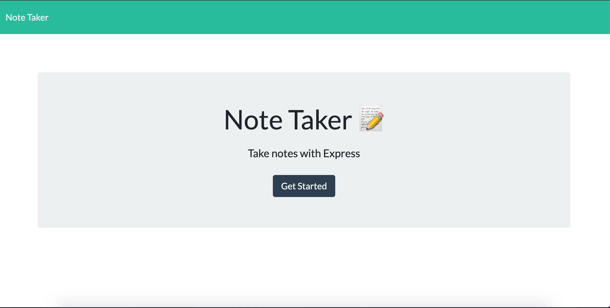
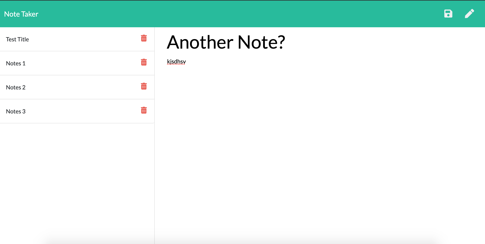

# note-taker

## Description

This project is about creating a note taking page that users can write multiple notes and have it be saved, so that the user can see it again once they close it. This project incorporates express npm modules and using servers as well as methods used previously such as get and post, read and write functions. The user will go to a link where the application is deployed. Once there the user will follow the instructions button to use the application.

This javascript code incorporates npm modules that commincate with websites and various other packages that make many javascipt functionalities easier to create. This code also incorporates using a server. For this instance we were able to take data (notes) from the user and send that data using a post method to a server where it stores that information. Then using a get method, retrieve that information and display that on to an html page that is easy to see. The simplicity of npm packages allows for the incorporation of many functions without many problems. Using a server enhanced the functionality by the user being able to store the data, all while using the webpage.
## Table of Contents

* [Installation](#installation)
* [Usage](#usage)
* [Credits](#credits)
* [License](#license)

## Instructions
1. Open the link https://note-taker-hl.herokuapp.com/
2. Click on the get started button to start taking notes.
3. Enter the title of the note
4. Type the note that you want to take.
5. Click the save button to save the note.
6. Click on the pencil button to create another note
7. Refresh the page to see all the notes taken

## Usage 
The homepage introduces the user to the application. Once the user clicks the get started button, the button redirects the user to the note taking page where the user can enter his or her notes and save them. The saved notes will be seen to the left of the page.
## Credits

Thanks to UW Coding Boot Camp and our instructor Joe for guiding me through the process. Also, thank you to the TA's Denis and Clint who are there everyday to help.

W3school for many of their online sources on css and html.
https://www.w3schools.com/ 

Bootstrap Code
https://getbootstrap.com/

## License

Attribution-ShareAlike 4.0 International

=======================================================================